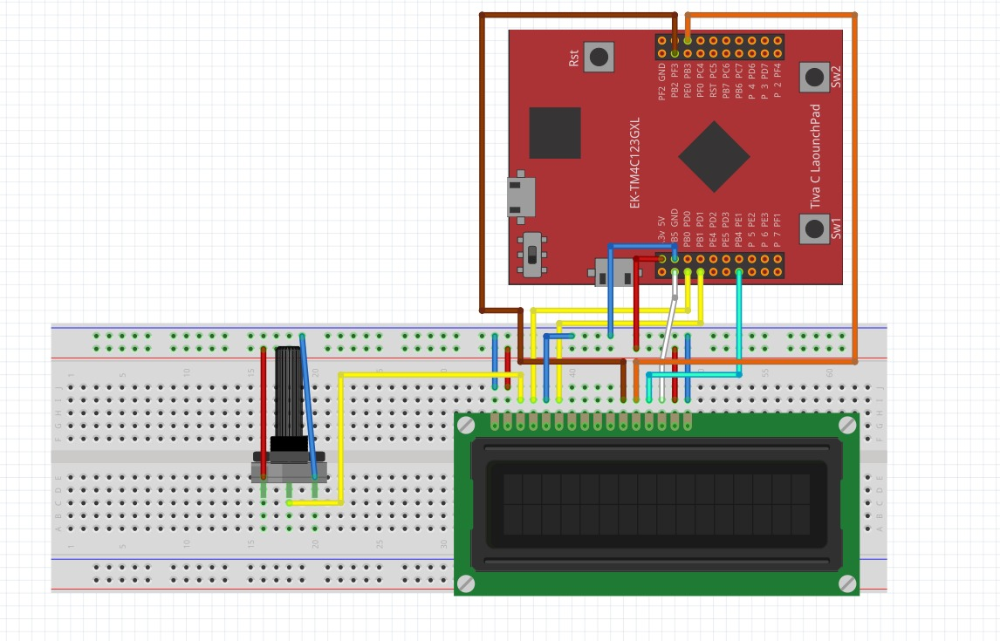
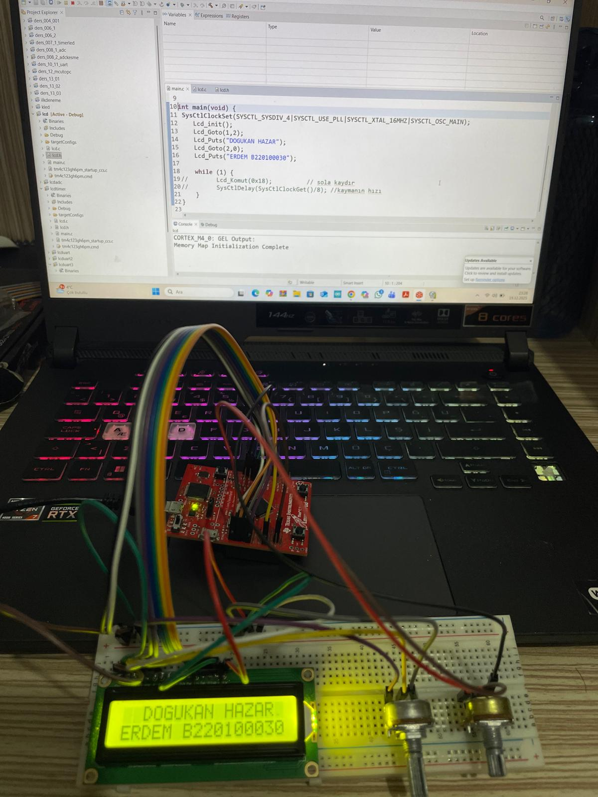
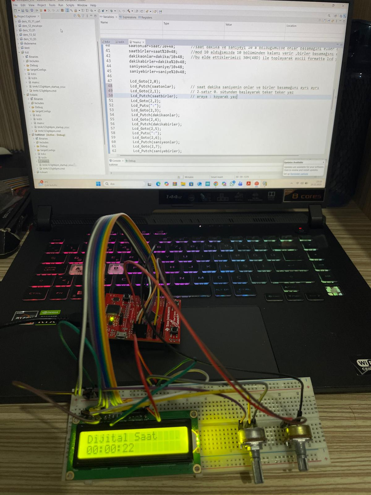
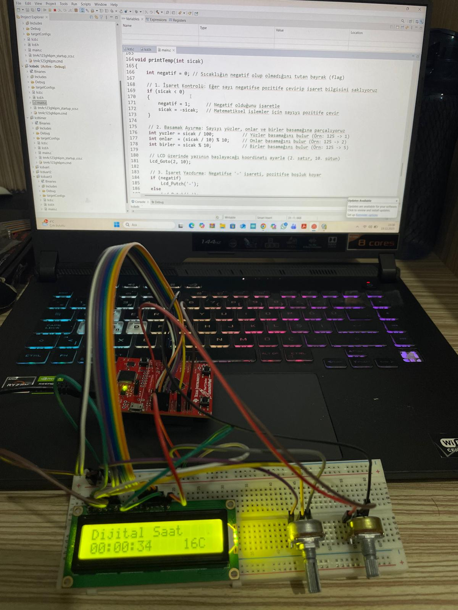
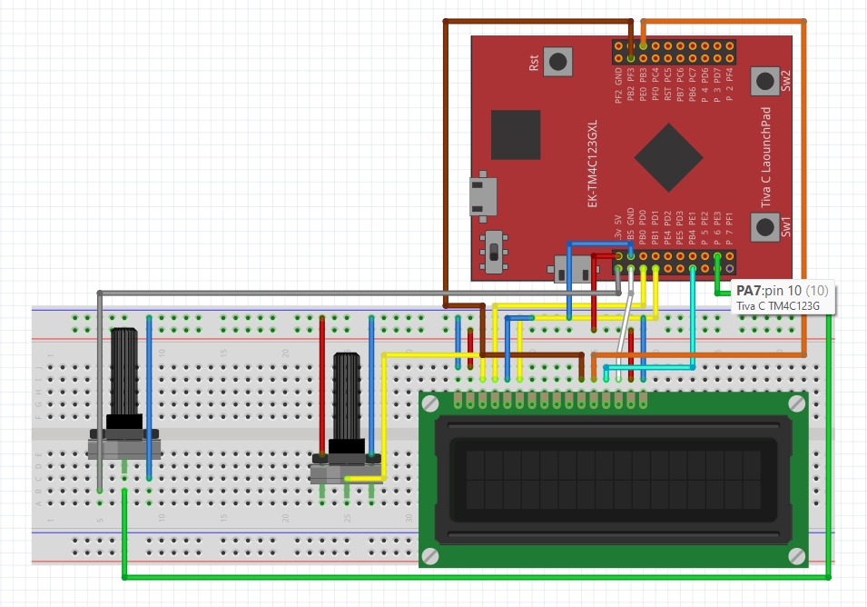
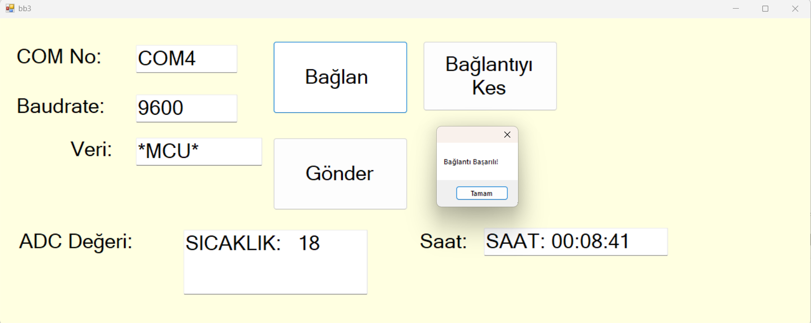
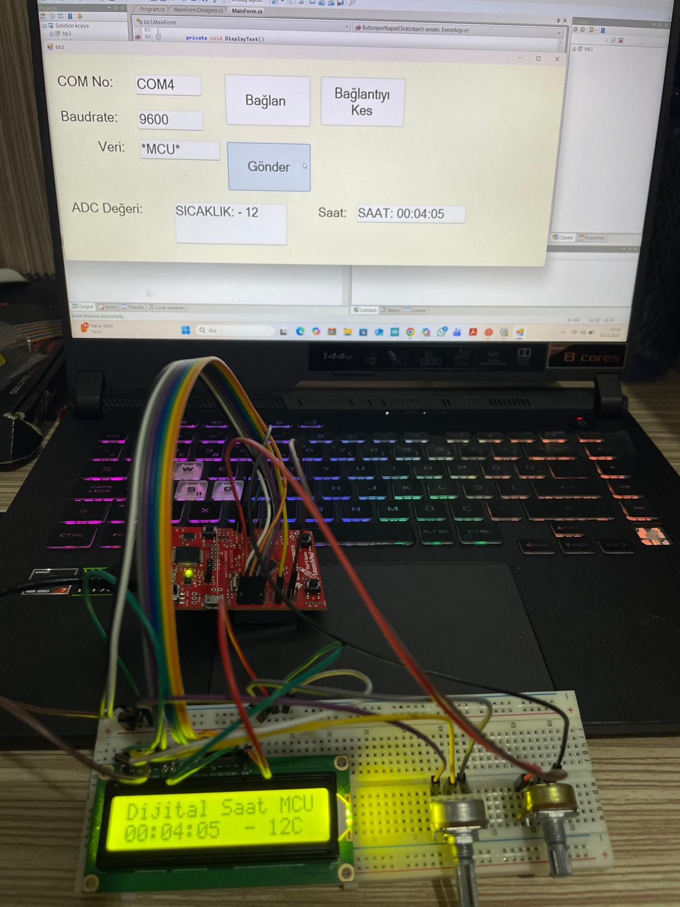
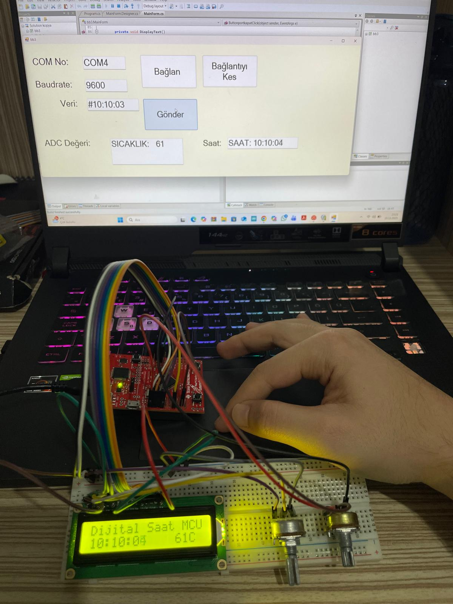
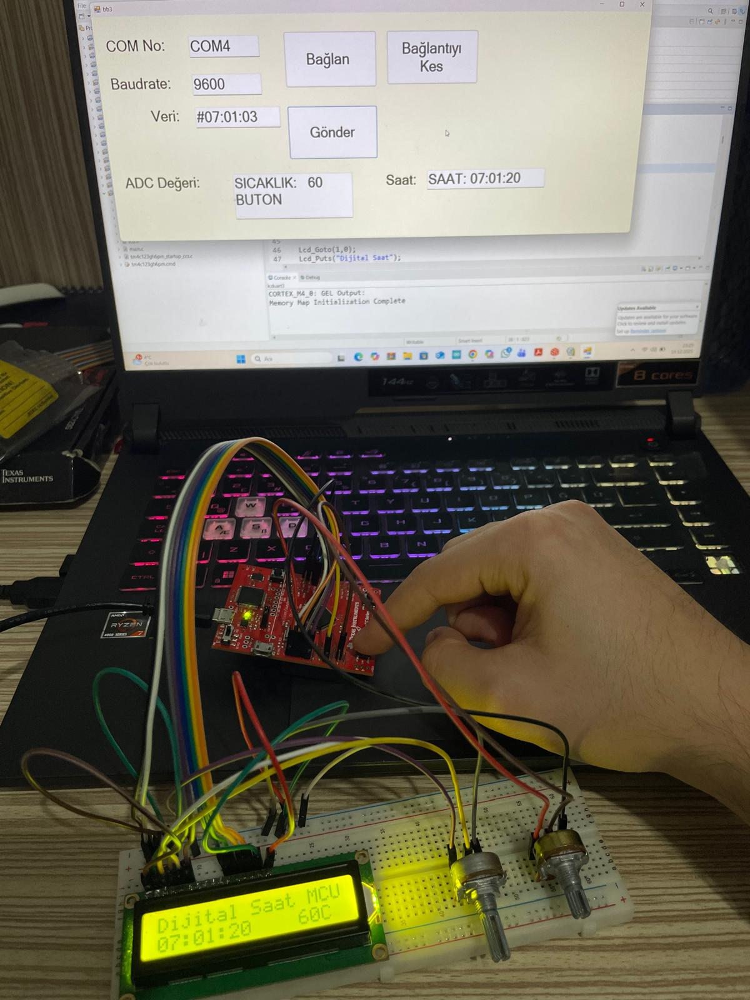
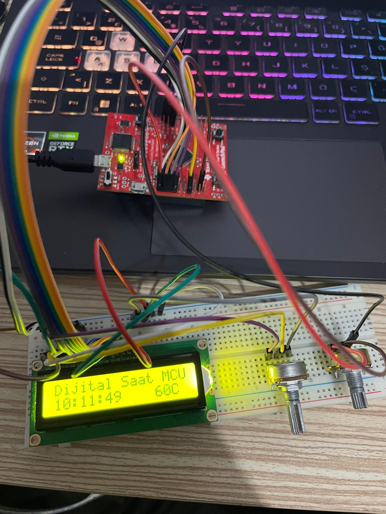

# İleri Mikroişlemciler Dersi Ödevleri

Bu depo, İleri Mikroişlemciler dersi kapsamında hazırladığım ödevleri içermektedir.

## Öğrenci Bilgileri
* **Ad Soyad:** Doğukan Hazar ERDEM
* **Öğrenci Numarası:** B220100030
* **Üniversite/Bölüm:** Sakarya Üniversitesi/Elektrik-Elektronik Mühendisliği

## Ödev Açıklamaları
* **Odev1_LCD_Driver:** Tiva C serisi kartıyla 16x2 karakter LCD ekranı süren C kodunu içerir. Tiva C serisi kart ile 16x2 LCD ekranın haberleşme protokollerini (RS, EN, Data pinleri) ve temel karakter yazdırma kütüphanesini kapsar.

**Devre Şeması:**

* **Odev2_Digital_Clock:** LCD ekran üzerinde anlık saati (SS:DD:SN) gösteren uygulamadır. Timer kesmeleri (interrupts) kullanılarak optimize edilmiş C kodu. Mikroişlemcinin donanımsal Timer (Zamanlayıcı) birimlerini kullanarak oluşturulan kesmeler (Interrupts) ile gerçek zamanlı saat uygulamasıdır.

* **Odev3_LCD_ADC:** Potansiyometre veya bir sensörden alınan analog verinin dijitale çevrilerek LCD'de görüntülenmesi. ADC yapılandırma ayarları ve verinin string formatına dönüştürülüp ekrana yazdırılması.

* **Odev4_Serial_GUI:** Seri haberleşme üzerinden bilgisayar arayüzü ile kontrol. Mikroişlemci ile bilgisayar arasında UART protokolü kullanılarak veri alışverişi yapılması ve bir arayüz (GUI) üzerinden donanımın kontrol edilmesi. Eğer GUI den gelen verinin ilk karakteri "#" ise, sistem bunu bir "Zaman Güncelleme" komutu olarak algılar. Takip eden veriler ayrıştırılarak LCD üzerinde anlık saat bilgisi (SS:DD:SN) güncellenir. Gelen verinin ilk karakteri "*" ise, sistem "Yazı Yazdırma" moduna geçer. Bu karakterden sonra gelen tüm alfabetik veriler doğrudan LCD ekranın ilgili satırına yazdırılır. SW1(PF4) e basıldığında GUI ekranında buton geri bildirimi olarak "BUTON" yazısı gelmektedir. Ayrıca anlık olarak saat değerimiz ve adc değerimiz GUI ekranında gözükmektedir.

## Kullanılan Donanım
* Tiva C Series TM4C123GH6PM